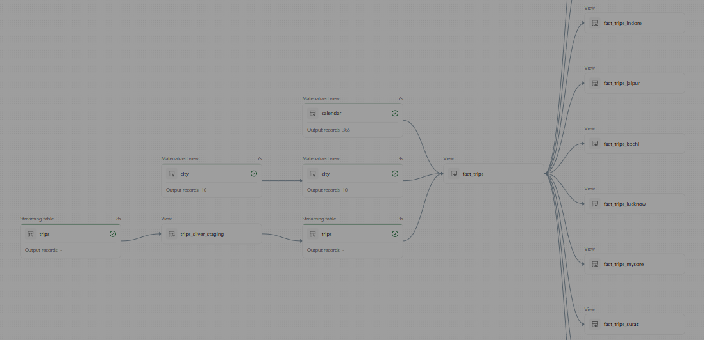

# End-to-End Bike Store Data Engineering Lakehouse
This project demonstrates a modern data engineering workflow built using Databricks and LakeFlow Spark Declarative Pipelines (SDP). The primary goal is to modernize a legacy procedural pipeline for a Bike Store and prepare high-quality data for analytics and machine learning workloads.

**Topics:**
- [Project Requirements](#project-requirements)
- [Project Steps](#project-steps)
- [Project Images](#project-images)
- [How to Connect AWS S3 to Databricks](#how-to-connect-aws-s3-to-databricks)

---

## Project Requirements
### **1️⃣ Data Engineering — Building the Lakehouse**

#### **Objective**
Build a modern Lakehouse architecture using Databricks and declarative pipelines to ingest, clean, and transform business data.

#### **Specifications**
- **Data Sources:** Import data from ERP and CRM systems stored in AWS S3.
- **Processing:** Build declarative data pipelines using Databricks LakeFlow and Apache Spark.
- **Data Quality:** Clean and standardize missing or inconsistent data.
- **Architecture:** Use Medallion Architecture (Bronze, Silver, Gold).
- **Analytics:** Prepare curated datasets for dashboards and analytical workloads.
- **Documentation:** Provide clear technical and architectural documentation.


### **2️⃣ BI & Analytics**
#### **Objective**
Develop analytical reporting and dashboards to generate business insights from Gold datasets.

#### **Analytics Goals**
- Sales performance analysis
- Customer behavior analysis
- Revenue trends analysis
- Product performance Insights


### **3️⃣ Machine Learning & AI**
#### **Objective**
Train machine learning models using curated Gold-layer datasets to generate predictive insights.

#### **ML Goals**
- Sales prediction
- Customer segmentation
- Product recommendation
- Demand forecasting

#### **ML Workflow**
- Feature engineering
- Dataset preparation
- Model training
- Model evaluation
- Prediction generation

[⤴️](#end-to-end-bike-store-data-engineering-lakehouse)

---

## Project Steps

### 📐 Design Data Architecture
- [x] Choose the Data Management Approach
- [x] Design the Pipeline Architecture
- [x] Design the Medallion Layers

### 🚧 Project Initialization
- [x] Create Repository Structure
- [x] Configure Git Integration
- [x] Connect Source Data to Databricks
- [ ] Create Catalogs and Schemas (Bronze, Silver, and Gold)
- [ ] Create a Declarative Pipeline in Databricks
- [ ] Define Project Naming Conventions

### 🥉 Build Bronze Layer
- [ ] Analysing: Source Systems
- [ ] Coding: Data Ingestion
- [ ] Validating: Data Completeness and Schema Consistency
- [ ] Document: Draw Data flow (Draw.io/IA)
- [ ] Commit Code into Git Repo

### 🥈 Build Silver Layer
- [ ] Analysing: Explore & Understand Data
- [ ] Document: Draw Data Integration (Draw.io/IA)
- [ ] Coding: Data Cleansing and Transformation Logic
- [ ] Validating: Data Quality and Correctness
- [ ] Document: Extend Data Flow (Draw.io/IA)
- [ ] Commit Code into Git Repo

### 🥇 Build Gold Layer
- [ ] Analysing: Business Entities and Metrics
- [ ] Coding: Business-Level Data Integrations
- [ ] Validating: Data Integration Checks
- [ ] Document: Draw Data Model of Star Schema (Draw.io/IA)
- [ ] Document: Extend Data Flow (Draw.io/IA)
- [ ] Commit Code into Git Repo

[⤴️](#end-to-end-bike-store-data-engineering-lakehouse)

---

## Project Images

### Design the Pipeline Architecture


### Design the Medallion Layers


[⤴️](#end-to-end-bike-store-data-engineering-lakehouse)

---

## How to Connect AWS S3 to Databricks

### S3 Bucket Setup
An S3 bucket is a container used to store files (objects) in the cloud.

### 🏗️ How it's structured
Inside the Amazon S3:

```
Bucket
|___Folder
    |____Object(file or folder)
         |_____ Data + Metabata.
```

### **🚢 How to create a Bucket:**
1. Gi to **AWS Console**
2. Open S3
3. Click **"Create bucket"**
4. Fill in:
   - **Bucket name**: must be globally unique
   - **Region**: Choose close to your data processing
5. Keep **Block all public access** enabled (recommended)
6. Click **Create bucket**

### **📁 How to create a folder:**
1. Open your bucket in S3
2. Click **Creata folder**
3. Enter a name in **Folder name**
4. Click **Create**

### **📄 How to insert files:**
1. Open your folder in bucket
2. Drag and Drop your files or click **Add files** to insert the files.
3. Click **Upload**

### **🔗 How to connect to Databricks:
1. Go to Catalog in Databricks
2. Click **External locations** in ⚙️
3. Click **Create external location**
4. Click **AWS Quickstart (Recommendend)** and after **Next**
5. Enter the **Bucket Name** (URL: s3://your_bucket_name)
6. Click **Generate new token** and copy it.
7. Click **Launch in Quickstart**
8. On the window that opened, past the token in **Databricks Pernsonal Access Token**,
9. Enable *I acknowlegde...* in the bottom of the page
10. click **Create stack**  

[⤴️](#end-to-end-bike-store-data-engineering-lakehouse)

